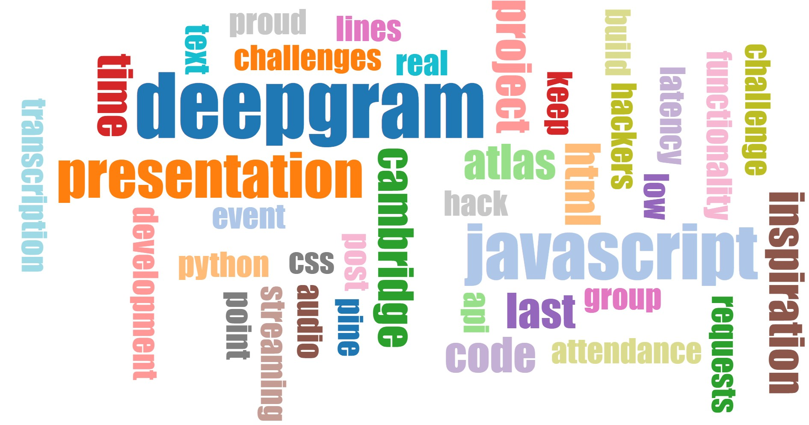

# ProcastiPoint!

## Inspiration
Coursework at Cambridge is tough, so we strived to make a program that made presentations easier. Our program creates a slodeshow on the fly using DeepGram's API.

## How we built it
Using JavaScript, HTML and the Deepgram API

## Challenges we ran into
We spent lots of early development time trying to make low latency audio streaming in Python. Grudgingly, we decided that this wasn't the way forward and wrote the whole project in Javascript.

## Accomplishments that we're proud of
Despite having near zero knowledge of Javascript, we picked it up as we went along somehow finding our way through asynchronous JS.

## What we learned
JavaScript is terrible. Or maybe not.

## What's next for ProcrastiPoint
Add more functionality/themes for the slides.